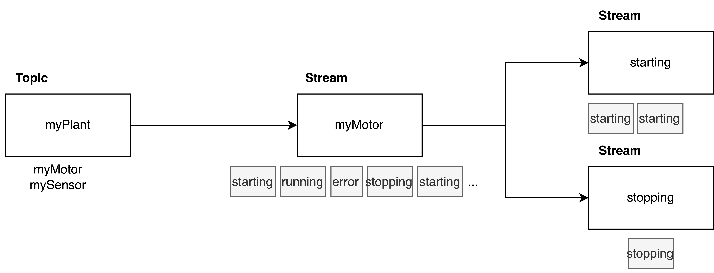
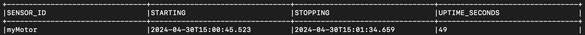
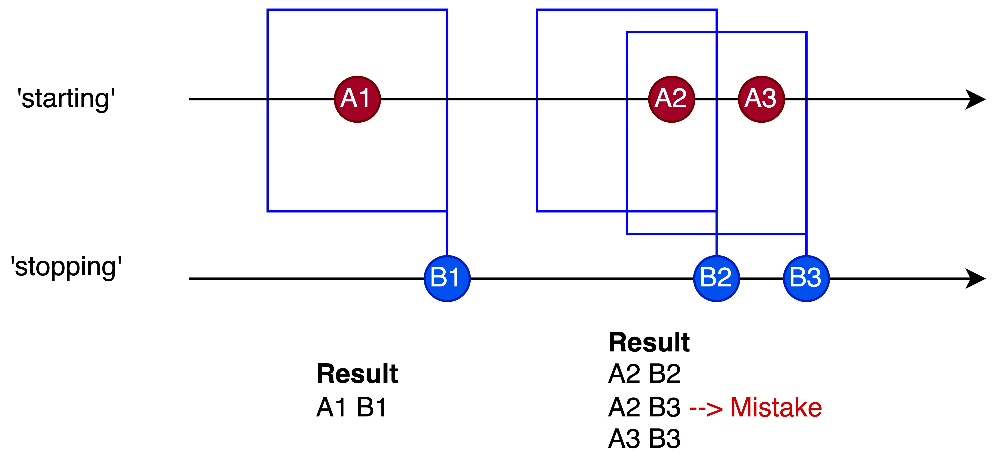
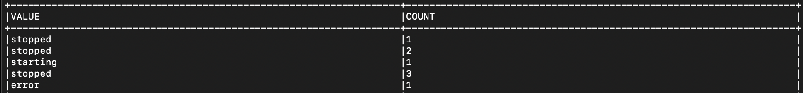
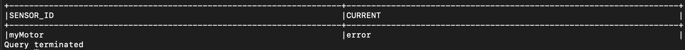
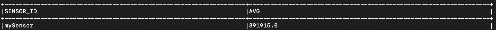
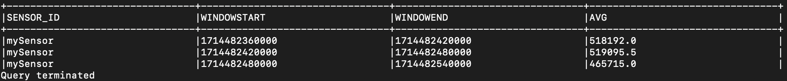

# KSQL Advanced

[⬅️ Back to Kafka overview](README.md)

Contents:
- Windowed Joins (Stream - Stream)
- Aggregations
- Windowed Aggregations
- Materialized Views

Make sure that the exercise environment is up and running:

```
docker-compose up -d
```

Start the KSQL CLI:

```
docker-compose exec ksqldb-cli ksql http://ksqldb-server:8088
```

## Windowed Joins
Windowed joins are required for `Stream-Stream` joins.

Assume the following scenario: we have 2 streams, one for motor 'starting' events and one for motor 'stopping' events and we want to 
alert, if a motor stops shortly after he had started.

Preparation:



Create a Stream for the `myPlant` Topic:
```
CREATE STREAM IF NOT EXISTS myplant_stream(sensor_id varchar, datetime bigint, value STRUCT<STRING VARCHAR, LONG BIGINT>) 
WITH (KAFKA_TOPIC = 'myPlant', value_format='AVRO');
```

Create a stream for motors:
```
CREATE STREAM IF NOT EXISTS myplant_motors_stream
AS select sensor_id, datetime, value->string as value from myplant_stream where sensor_id = 'myMotor';
```

Create two separate stream for 'starting' and 'stopping' events:
```
CREATE STREAM mymotor_starting_stream
AS select sensor_id, datetime, value from myplant_motors_stream where value = 'starting';
```

```
CREATE STREAM mymotor_stopping_stream
AS select sensor_id, datetime, value from myplant_motors_stream where value = 'stopping';
```

### Excercise 1 - Identify when motor stops shortly after start

- Write a select statement that
  - joins the `mymotor_starting_stream` with the `mymotor_stopping_stream` within 2 minutes
  - Hint: use `INNER JOIN` and the `WITHIN` clause

Expected output:


💡 It may take some time for the data to appear in those streams

### Bonus question



The solution of Exercise 1 has the following limitation
- If there are multiple 'starting' events within the time window of 2 minutes,
the query will match each one
- A 'stopping' event should only match the most recent 'starting' event

How would you solve this?

## Aggregation

Preparation:

Create a Stream for the `myPlant` Topic:
```
CREATE STREAM IF NOT EXISTS myplant_stream(sensor_id varchar, datetime bigint, value STRUCT<STRING VARCHAR, LONG BIGINT>) 
WITH (KAFKA_TOPIC = 'myPlant', value_format='AVRO');
```

Create a stream for motors:
```
CREATE STREAM IF NOT EXISTS myplant_motors_stream
AS select sensor_id, datetime, value->string as value from myplant_stream where sensor_id = 'myMotor';
```

### Exercise 2 - Count motor state changes

- Write a select statement that:
  - Counts the records in the`myplant_motors_stream` by the `value` field

Expected output:


### Excercise 3 - Latest value by offset

- Write a select statement that:
  - Selects the latest `value` in the `myplant_motors_stream`
  - Stores the result in a `Table` (Materialized view)
  - Hint: use the `LATEST_BY_OFFSET` aggregation function

Expected output:


## Windowed Aggregation

Preparation:

Create a Stream for the `myPlant` Topic:
```
CREATE STREAM IF NOT EXISTS myplant_stream(sensor_id varchar, datetime bigint, value STRUCT<STRING VARCHAR, LONG BIGINT>) 
WITH (KAFKA_TOPIC = 'myPlant', value_format='AVRO');
```

Create a stream for sensors:
```
CREATE STREAM IF NOT EXISTS myplant_sensors_stream
AS select sensor_id, datetime, value->long as value from myplant_stream where sensor_id = 'mySensor';
```

### Exercise 4 - Aggregate sensor values with tumbling window

- Write a select statement that:
  - Aggregates the records in the `myplant_sensors_stream` by `sensor_id` averaging the `value` field
  - Uses a time window of 60 seconds

Expected output:


### Exercise 5 - Window retention

- Extend the statement from the previous excercise to:
  - Remove old time windows after 2 minutes
  - Store the result in a `Table` (Materialized view)

Expected output:


💡The `window retention period` must be greater than or equal to the `window size` plus the `grace period`.
