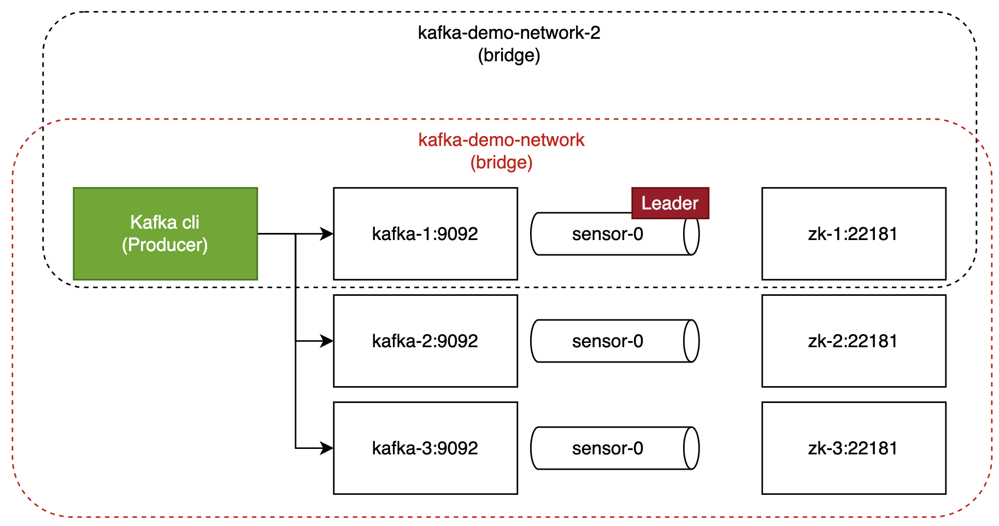
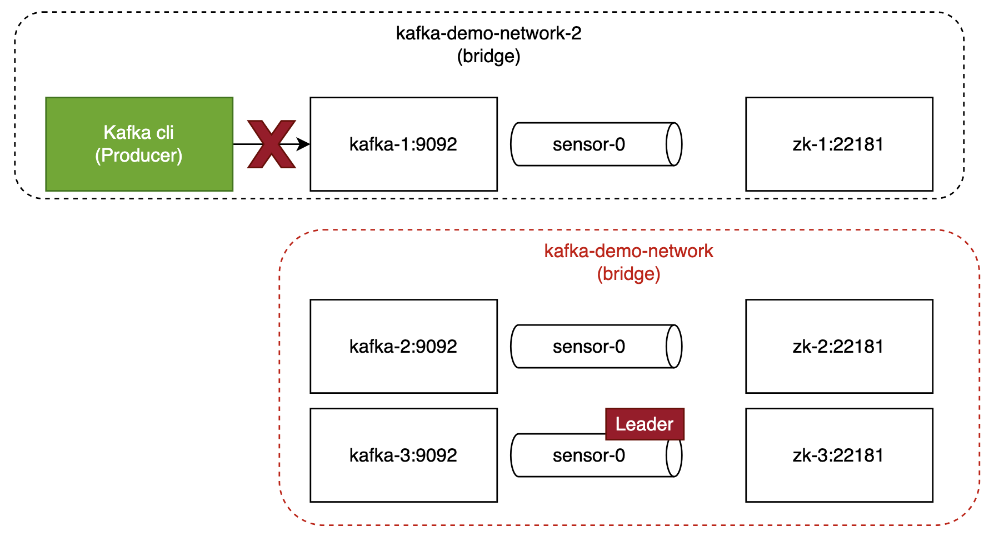

# 1. Setup cluster

```
docker network create -d bridge kafka-demo-network
docker network create -d bridge kafka-demo-network-2

docker create \
   --network kafka-demo-network \
   --name=zk-1 \
   -e ZOOKEEPER_SERVER_ID=1 \
   -e ZOOKEEPER_CLIENT_PORT=22181 \
   -e ZOOKEEPER_TICK_TIME=2000 \
   -e ZOOKEEPER_INIT_LIMIT=5 \
   -e ZOOKEEPER_SYNC_LIMIT=2 \
   -e ZOOKEEPER_SERVERS="zk-1:22888:23888;zk-2:22888:23888;zk-3:22888:23888" \
   confluentinc/cp-zookeeper:7.3.2

docker network connect kafka-demo-network-2 zk-1
docker start zk-1

docker run -d \
   --net=kafka-demo-network \
   --name=zk-2 \
   -e ZOOKEEPER_SERVER_ID=2 \
   -e ZOOKEEPER_CLIENT_PORT=22181 \
   -e ZOOKEEPER_TICK_TIME=2000 \
   -e ZOOKEEPER_INIT_LIMIT=5 \
   -e ZOOKEEPER_SYNC_LIMIT=2 \
   -e ZOOKEEPER_SERVERS="zk-1:22888:23888;zk-2:22888:23888;zk-3:22888:23888" \
   confluentinc/cp-zookeeper:7.3.2

docker run -d \
   --net=kafka-demo-network \
   --name=zk-3 \
   -e ZOOKEEPER_SERVER_ID=3 \
   -e ZOOKEEPER_CLIENT_PORT=22181 \
   -e ZOOKEEPER_TICK_TIME=2000 \
   -e ZOOKEEPER_INIT_LIMIT=5 \
   -e ZOOKEEPER_SYNC_LIMIT=2 \
   -e ZOOKEEPER_SERVERS="zk-1:22888:23888;zk-2:22888:23888;zk-3:22888:23888" \
   confluentinc/cp-zookeeper:7.3.2

docker create \
    --net=kafka-demo-network \
    --name=kafka-1 \
    -p 19092:9092 \
    -e KAFKA_BROKER_ID=1 \
    -e KAFKA_ZOOKEEPER_CONNECT=zk-1:22181,zk-2:22181,zk-3:22181 \
    -e KAFKA_ADVERTISED_LISTENERS=PLAINTEXT://kafka-1:9092 \
    confluentinc/cp-kafka:7.3.2

docker network connect kafka-demo-network-2 kafka-1
docker start kafka-1

docker run -d \
    --net=kafka-demo-network \
    --name=kafka-2 \
    -p 29092:9092 \
    -e KAFKA_BROKER_ID=2 \
    -e KAFKA_ZOOKEEPER_CONNECT=zk-1:22181,zk-2:22181,zk-3:22181 \
    -e KAFKA_ADVERTISED_LISTENERS=PLAINTEXT://kafka-2:9092 \
    confluentinc/cp-kafka:7.3.2

docker run -d \
     --net=kafka-demo-network \
     --name=kafka-3 \
     -p 39092:9092 \
     -e KAFKA_BROKER_ID=3 \
     -e KAFKA_ZOOKEEPER_CONNECT=zk-1:22181,zk-2:22181,zk-3:22181 \
     -e KAFKA_LISTENERS=PLAINTEXT://kafka-3:9092 \
     -e KAFKA_ADVERTISED_LISTENERS=PLAINTEXT://kafka-3:9092 \
     confluentinc/cp-kafka:7.3.2
```

### Inspect the networks (optional)
```
docker network inspect kafka-demo-network
docker network inspect kafka-demo-network-2
```

# 2. Create topic and produce some messages
```
docker run -it --net=kafka-demo-network-2 --name=kafka-cli --rm  confluentinc/cp-kafka:7.3.2 /bin/bash
docker network connect kafka-demo-network-2 kafka-cli
```
```
cd /bin && ./kafka-topics --bootstrap-server kafka-1:9092,kafka-2:9092,kafka-3:9092 --create --topic sensor --partitions 1 --replication-factor 3 --if-not-exists
./kafka-topics --bootstrap-server kafka-1:9092,kafka-2:9092,kafka-3:9092 --list
./kafka-topics --bootstrap-server kafka-1:9092,kafka-2:9092,kafka-3:9092 --describe --topic sensor
seq 42 | ./kafka-console-producer --broker-list kafka-1:9092,kafka-2:9092,kafka-3:9092 --topic sensor && echo 'Produced 42 messages.'
```

# 3. Disconnect leader

Prerequisites: kafka-1 needs to be leader
``` 
docker network disconnect kafka-demo-network zk-1
docker network disconnect kafka-demo-network kafka-1
docker network disconnect kafka-demo-network kafka-cli
```

# 4. Write to disconnected leader
``` 
./kafka-console-producer --broker-list kafka-1:9092 --topic sensor && echo 'Produced 42 messages.'
``` 
Result: Kafka does not allow to write to the old leader. A new leader is elected at the moment, when kafka-1,zk-1 leave the network
