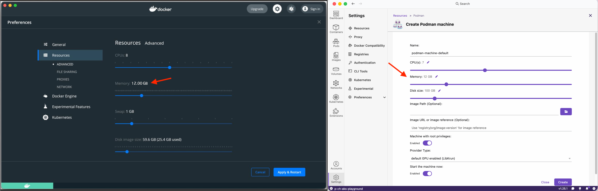
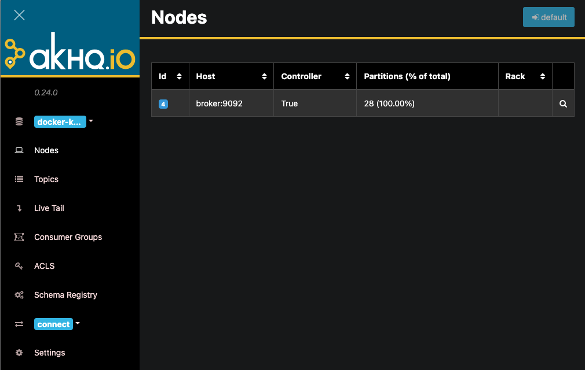

# Kafka Training Environment

[⬅️ Back to Kafka overview](README.md)

## Training environment

This training comes with a predefined environment provided in multiple docker containers.

## Windows with WSL 2.0 & Mac: Start the training environment

Open a shell and run the following commands to check out the course repository and start the environment.

```bash
git clone https://github.com/Zuehlke/kafka-streaming-technology.git
cd kafka-streaming-technology
docker compose up -d
```

💡 Detailed instruction to **fulfill all system requirements** are described further down.

💡 If Git is need to be installed on Ubuntu use the following command:

```bash
sudo apt install -y git
```

Verification
To check things are up and running, execute the following command. There should be a list of running containers. The status should be up and healthy for all containers.

```bash
docker ps

Example output
CONTAINER ID  IMAGE                                                           COMMAND               CREATED         STATUS         PORTS                               NAMES
ea770e5513a0  docker.io/library/mariadb:12.1                                  mariadbd              14 minutes ago  Up 14 minutes  0.0.0.0:3306->3306/tcp              mariadb
b43a160e94fd  docker.io/confluentinc/cp-server:8.0.3                          /etc/confluent/do...  14 minutes ago  Up 14 minutes  0.0.0.0:29092->29092/tcp, 9092/tcp  controller
f637558dd99f  docker.io/phpmyadmin/phpmyadmin:5.2.3                           apache2-foregroun...  14 minutes ago  Up 14 minutes  0.0.0.0:8085->80/tcp                pma
0b6c60bddd53  docker.io/confluentinc/cp-server:8.0.3                          /etc/confluent/do...  14 minutes ago  Up 14 minutes  0.0.0.0:9092-9094->9092-9094/tcp    broker
b728211640eb  docker.io/confluentinc/cp-schema-registry:8.0.3                 /etc/confluent/do...  14 minutes ago  Up 14 minutes  0.0.0.0:8081->8081/tcp              schema-registry
14686479de61  docker.io/confluentinc/cp-kafka-rest:8.0.3                      /etc/confluent/do...  14 minutes ago  Up 14 minutes  0.0.0.0:8082->8082/tcp              rest-proxy
7363791149c3  ghcr.io/zuehlke/kafka-streaming-technology/motor-kraft:latest                         14 minutes ago  Up 14 minutes                                      motor
4cd2ecec24cf  ghcr.io/zuehlke/kafka-streaming-technology/sensor-kraft:latest                        14 minutes ago  Up 14 minutes                                      sensor
03039b899f58  docker.io/confluentinc/cp-kafka-connect:8.0.3                   /bin/bash -c mkdi...  14 minutes ago  Up 14 minutes  0.0.0.0:8083->8083/tcp, 9092/tcp    connect
46ad0356eb1b  docker.io/tchiotludo/akhq:0.24.0                                ./akhq                14 minutes ago  Up 14 minutes  0.0.0.0:8080->8080/tcp              akhq
52a6da6200b0  docker.io/confluentinc/cp-ksqldb-server:8.0.3                   /etc/confluent/do...  14 minutes ago  Up 14 minutes  0.0.0.0:8088->8088/tcp              ksqldb-server
72848c1d7fbf  docker.io/confluentinc/cp-ksqldb-cli:8.0.3                                            14 minutes ago  Up 14 minutes                                      ksqldb-cli
```

In addition, you can visit http://localhost:8080/ and check if akHQ is running appropriately if you see the node here http://localhost:8080/ui/docker-kafka-server/node.

💡 The whole environment is quite main memory intensive. We recommend a computer with at least 16 GB of working memory.

## Technical prerequisite for the training

The following service components should be installed on your training device before attending the training. A detailed installation guide will be given afterwards.

- Docker Desktop
- Development:
  - VS Code (or your IDE/text editor of choice)
  - Current Java JDK
  - Git
  - Maven (if not already included in IDE)
- Optional: HTTP client to send requests like Postman

In addition, required for Windows users:

- Windows Subsystem for Linux (WSL)
- Ubuntu 20.04 for WSL (recommended, other distributions might work too)
- Windows Terminal (optional, but very nice)

## Step-by-Step Guide: Preparation of Notebook for Windows Users

Enable nested virtualization
Only required if running inside a VM
https://docs.microsoft.com/en-us/virtualization/hyper-v-on-windows/user-guide/nested-virtualization

Install WSL
https://docs.microsoft.com/en-us/windows/wsl/install
In a shell with admin permissions run

```bash
wsl --install
```

Ensure you're running WSL 2 and not the legacy WSL 1

```bash
wsl --status
```

Example output
Default Distribution: Ubuntu
**Default Version: 2**

Windows Subsystem for Linux was last updated on 8 Nov 2021
WSL automatic updates are on.

Kernel version: 5.10.60.1

If Ubuntu is already installed, please ensure that it is using WSL 2. You can check this with the following command.

```bash
wsl -l -v
```

Install Windows Terminal (optional)
See https://docs.microsoft.com/en-us/windows/terminal/install
Optional but very nice to use 😊

Install Ubuntu 20.04 from the Microsoft store
See https://www.microsoft.com/store/productId/9N6SVWS3RX71 Alternative link: https://aka.ms/wslstore
You should now be able to run the Ubuntu app


or select the shell in the Windows Terminal


On first run you'll be asked to set up a user.

Install Docker Desktop
Note: If you plan on using Docker Desktop commercially, please ensure you sign up for a paid account.
See https://www.docker.com/products/docker-desktop

Enable WSL backend in Docker Desktop
Note: This is probably already your default if installed after WSL


Enable WSL integration in Docker Desktop
This is to enable direct access to Docker from your distribution and add the necessary binaries.


(you don't see this slider? => see below troubleshooting)

Confirm all changes to Docker Desktop with the press of “Apply & Restart”


It should be now possible to run the command "docker ps" in your Ubuntu shell. If the command can be executed but you are lacking permission, your user need to be added to the docker group.

```bash
sudo usermod -a -G docker your_user
```

## Step-by-Step Guide: Preparation of Notebook for Mac Users

Install Docker Desktop or Podman Desktop

> [!NOTE]
> If you plan on using Docker Desktop commercially, please ensure you sign up for a paid account.
> See https://www.docker.com/products/docker-desktop

For Mac you should choose 12 GB of memory like depicted in the picture.
If you have less than 8 GB of memory available, you can get into trouble with the broker acting up.



## Services overview

- akHQ - Manage & view data inside your Apache Kafka cluster: http://localhost:8080/
- phpMyAdmin: http://localhost:8085/ Leave the field for the server blank and type for the **username** and **password** "**kafka-training**". The preferred language can be change on the start page.
- Kafka Broker: localhost on port 9092
- Kafka Controller: localhost on port 29092
- Schema Registry: localhost on port 8081
- Rest Proxy: localhost on port 8082
- Kafka Connect: localhost on port 8083
- ksqlDB: localhost on port 8088
- MariaDB: localhost on port 3306

## akHQ

Manage & view data inside your Apache Kafka ® cluster



Further information can be found on the product website https://akhq.io/

## Troubleshooting

💡 All Docker Compose commands must be executed in the top folder of your training material.

Restart your environment:

```bash
docker compose restart
```

Stop and remove resources of your environment

```bash
docker compose down
```

Delete your local persistent data:

```bash
docker volume rm kafka-streaming-technology_db_conf kafka-streaming-technology_db_data
```

Cleanup hanging docker instances:

```bash
docker stop $(docker ps -q)

docker rm $(docker ps -a -q)
```

Restart & Logs: You can use Docker Desktop / Podman Desktop to restart container and read logs. As an alternative you can use the command line.

```bash
# List all running container.
docker ps

# Example to restart Kafka Connect
docker restart connect

# Print out all logs for Kafka Connect
docker logs connect

# Follow the logs for Kafka Connect
docker logs -f connect

```

Another option to access logs is by clicking on the container in Docker Desktop / Podman Desktop.


Using WSL 2.0 and cannot connect to Kafka broker with Spring Boot. Error: _Bootstrap broker localhost (id : -1 rack: null) disconnected_

```bash
# Get the external interface IP adress on Ubuntu terminal
ip addr | grep eth0

#  Open PowerShell as a Administrator and add a port proxy
netsh interface portproxy add v4tov4 listenport=9092 listenaddress=0.0.0.0 connectport=9092 connectaddress=YOUR_IP_OF_EXTERNAL_INTERFACE
```

Link: https://docs.microsoft.com/en-us/windows/wsl/networking

You see the following error when starting docker desktop on Windows, or when you start Ubuntu:

```
Logon failure: the user has not been granted the requested logon type at this computer.
Press any key to continue...
```


Start a powershell as administrator

```bash
Get-Service vmcompute | Restart-Service
```

Docker desktop for windows: You don't see the Ubuntu slider in Resources -> WSL integration:

```
PS C:\Users\U1> wsl -l -v
  NAME                   STATE           VERSION
* docker-desktop-data    Running         2
  docker-desktop         Running         2
  Ubuntu-20.04           Stopped         1
PS C:\Users\U1> wsl --set-version Ubuntu-20.04 2
Conversion in progress, this may take a few minutes...
For information on key differences with WSL 2 please visit https://aka.ms/wsl2
Conversion complete.
PS C:\Users\U1> wsl --set-default  Ubuntu-20.04
PS C:\Users\U1> wsl -l -v
  NAME                   STATE           VERSION
* Ubuntu-20.04           Running         2
  docker-desktop         Running         2
  docker-desktop-data    Running         2
PS C:\Users\U1>
```

- reinstall docker desktop

